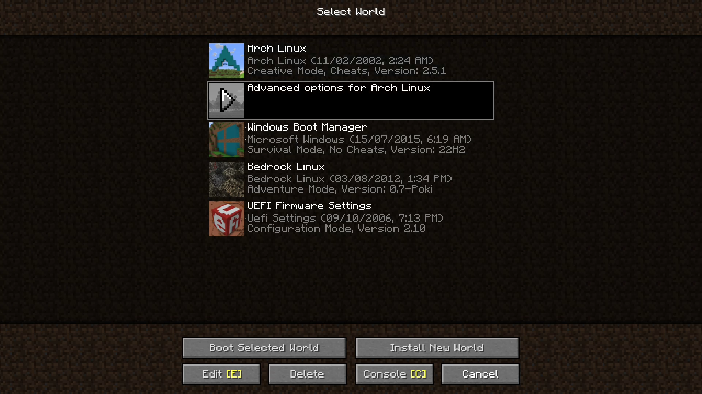

**The Minecraft Grub Theme Trio:**

| [Minecraft Main Menu](https://github.com/Lxtharia/minegrub-theme) | *> Minecraft World Selection Menu <* | [Using both themes together](https://github.com/Lxtharia/double-minegrub-menu) |
| --- | --- | --- |

**Also check out these other projects:**
| [Minecraft SDDM Theme](https://github.com/Davi-S/sddm-theme-minesddm) by Davi-S | [Minecraft Plymouth Theme](https://github.com/nikp123/minecraft-plymouth-theme) by nikp123 | [Minecraft World Loading KDE Splash](https://github.com/Samsu-F/minecraftworldloading-kde-splash) by Samsu-F
| --- | --- | --- |

# Minecraft World Selection Grub Theme

Wowie, another Minecraft grub theme! But this time it's in the style of the singleplayer world selection menu, which makes a little more sense than selecting your operating system from the main menu.
There are also *icons* now! Isn't that great? And even better, they also include the descriptive text below each boot option!



# Installation

## AUR

This package is available on the AUR! You can view the package [here][aur].

To install, simply do something like the following:

```bash
yay -S grub-theme-minegrub-world-selection-git
```

Or, clone the AUR git repo locally (containing the `PKGBUILD` and such), and run `makepkg -cris`.


## Manual (linux)

- Clone this repository
  ```
  git clone https://github.com/Lxtharia/minegrub-world-sel-theme.git
  ```
- [Optional]: Choose the background matching your screen size from `assets/background-scaled/...`
  - And copy it to `minegrub-world-selection/background.png`
- Enter the cloned repository
  ```
  cd ./minegrub-world-sel-theme
  ```
- Copy the folder to your boot partition
  > **NOTE**: 
  > On some distros (like fedora) the path is `/boot/grub2/...` instead of `/boot/grub/...` so you might need to adjust the commands for that
  ```
  sudo cp -ruv ./minegrub-world-selection /boot/grub/themes/
  ```
- Change/add these line in your `/etc/default/grub`:
  ```
  GRUB_TERMINAL_OUTPUT=gfxterm
  GRUB_THEME=/boot/grub/themes/minegrub-world-selection/theme.txt
  ```
- Update your live grub config
  - Run this command:
     ```
    sudo grub-mkconfig -o /boot/grub/grub.cfg
    ```
  - Or this on Fedora:
    ```
    sudo grub2-mkconfig -o /boot/grub2/grub.cfg
    ```

## NixOS flake

<details>
<summary>Minimal example</summary>

```nix
# flake.nix
{
  inputs.minegrub-world-sel-theme.url = "github:Lxtharia/minegrub-world-sel-theme";
  # ...

  outputs = {nixpkgs, ...} @ inputs: {
    nixosConfigurations.HOSTNAME = nixpkgs.lib.nixosSystem {
      modules = [
        ./configuration.nix
        inputs.minegrub-world-sel-theme.nixosModules.default
      ];
    };
  }
}

# configuration.nix
{ pkgs, ... }: {

  boot.loader.grub = {
    minegrub-world-sel = {
      enable = true;
      customIcons = [{
        name = "nixos";
        lineTop = "NixOS (23/11/2023, 23:03)";
        lineBottom = "Survival Mode, No Cheats, Version: 23.11";
        # Icon: you can use an icon from the remote repo, or load from a local file
        imgName = "nixos";
        # customImg = builtins.path {
        #   path = ./nixos-logo.png;
        #   name = "nixos-img";
        # };
      }];
    };
  };

}
```
</details>


# Icons

GRUB can add icons to each entry, based on the `--class` properties of a `menuentry`.
This theme makes use of this to have each entry have its own icon _and_ world description!
**Example:**
```bash
# grub will try to use /boot/grub/themes/minegrub-world-selection/icons/arch.png as the icon and falls back on  gnu-linux.png,  gnu.png  and  os.png
menuentry 'Arch Linux' --class arch --class gnu-linux --class gnu --class os $menuentry_id_option 'gnulinux-simple-somefunnyuuid' {
  ...
}
```

## Setting icons for entries like Uefi Settings

> If you want items like Uefi Settings to have an icon, you need to add `--class uefi` manually to the menuentry line in `/boot/grub/grub.cfg`:
>
>  `menuentry "Uefi Settings" --class uefi ...`
>
> In this case you can put it in `/etc/grub.d/30_uefi-firmware` so it doesn't get overwritten when you regenerate your grub.cfg :>


## [Generating/Contributing icons](icon-generator/README.md)

Click to read more ^

# Great

- I like writing Readme but at the same time, it takes too long and it's never perfect
- Everything feels like chaos
- I spent too much time on this
- Tell your grandparents and pets about this cool theme!
- Put it on your laptop, put it on your smartwatch put it on your schools PCs (i won't take responsibility if you get expelled)
- Install it on your mouse-with-screen, copy it to your flash drives
- Btw, have I mentioned that I use arch?
- I have a grand secret project that I may reveal soon
- Maybe it eats your food, maybe it doesn't
- Thank you internet for wisdom and funny youtube clips that kept me motivated on my journey
- **Go check out the other Minegrub: [Minegrub Theme](https://github.com/Lxtharia/minegrub-theme)**


  [aur]:https://aur.archlinux.org/packages/grub-theme-minegrub-world-selection-git
