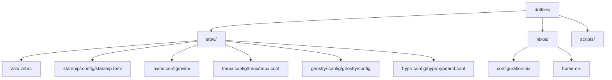

<!--
README principal des dotfiles de RikiLaNeko
Dernière mise à jour : 2025-07-02
-->

<h1 align="center"> Dotfiles de <a href="https://github.com/RikiLaNeko">RikiLaNeko</a></h1>

  <b>Configuration Unix élégante, modulaire & intelligente</b>
   
  <a href="https://nixos.org/">NixOS 25.05</a> • <a href="https://hyprland.org">Hyprland</a> • <a href="https://www.gnu.org/software/stow/">GNU Stow</a> • <a href="https://github.com/ghostty-org/ghostty">Ghostty</a> • <a href="https://github.com/catppuccin/catppuccin">Catppuccin</a>

  
  
  
  

---

## 📖 Table des matières

- [Aperçu](#-aperçu)
- [Diagramme de structure](#-diagramme-de-structure)
- [Organisation & Workflow](#-organisation--workflow)
- [Dotfiles inclus](#-dotfiles-inclus)
- [Philosophie](#-philosophie)
- [Pour aller plus loin](#-pour-aller-plus-loin)
- [Crédits](#crédits)

---

## 🌟 Aperçu

Ce repo regroupe **tous mes dotfiles Unix** pour un setup moderne, modulaire, esthétique et portable.  
Optimisé pour :

- [NixOS 25.05](https://nixos.org/),
- [Hyprland](https://hyprland.org/) (Wayland WM),
- [GNU Stow](https://www.gnu.org/software/stow/),
- [Catppuccin](https://catppuccin.com/) (thème global),
- [Ghostty](https://github.com/ghostty-org/ghostty) (terminal nouvelle génération).

---

## 🗺️ Diagramme de structure

---

## 💼 Organisation & Workflow

- Configs rangées par app dans `stow/`, prêtes à être symlinkées grâce à [GNU Stow](https://www.gnu.org/software/stow/).
- Fichiers `.zshrc` ou autres en racine → `stow/zsh/.zshrc`
- Configs XDG (`.config/`) → `stow/xxx/.config/xxx/`
- Config NixOS et Home Manager dans `nixos/`

> Pour la gestion Stow, voir le [guide détaillé](./stow/README.md).

---

## 🦄 Dotfiles inclus

- **Zsh** : prompt moderne (Starship), plugins zinit, snippets, aliases, historique (Atuin), navigation rapide (zoxide)
- **Starship** : prompt cross-shell stylé Catppuccin
- **Neovim** : configuration Lua complète, plugins, ergonomie
- **Tmux** : splits, status bar, plugins TPM, keybinds smart (migration future vers Zellij)
- **Ghostty** : terminal nouvelle génération (Catppuccin, Iosevka)
- **Hyprland** : WM dynamique, gaps, blur, launchers custom
- **Waybar** : barres de status, quicklinks, intégration Ghostty/Nvim
- **Scripts** : helpers, automatisation

---

## 💡 Philosophie

- **Modularité** : chaque app indépendante, stow/unstow à volonté
- **Esthétique** : Catppuccin partout, police Iosevka, cohérence UX
- **Reproductibilité** : rebuild NixOS ou symlinks instantanés sur n’importe quel système
- **Automatisation** : scripts, snippets, aliases, rebuild facile

---

## 🪄 Pour aller plus loin

- [Gestion Stow (guide complet)](./stow/README.md)
- [Configuration NixOS avancée](./nixos/README.md)

---

## 🙏 Crédits

Merci à toutes les communautés open-source et à [Catppuccin](https://catppuccin.com/) pour l’inspiration visuelle.

---

> **Une question, une suggestion ? Ouvre une issue ou un PR !**
