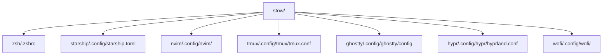

<!--
README · dotfiles de RikiLaNeko
Dernière mise à jour : 2025-07-06
-->

<h1 align="center">
  <br/>
  Dotfiles de RikiLaNeko
</h1>

<p align="center">
  <i>Merci à <a href="https://catppuccin.com/">Catppuccin</a> pour l’inspiration, les thèmes, et la communauté 💜</i><br/>
  <a href="https://matrix.to/#/#catppuccin:matrix.org">Rejoindre le chat Catppuccin</a>
</p>

<p align="center">
  <a href="https://nixos.org/"></a>
  <a href="https://www.gnu.org/software/stow/"></a>
  <a href="https://starship.rs/"></a>
  <a href="https://ohmyz.sh/"></a>
  <a href="https://neovim.io/"></a>
  <a href="https://github.com/ghostty-org/ghostty"></a>
  <a href="https://hyprland.org/"></a>
  <a href="https://catppuccin.com/"></a>
</p>

---

## 🧐 Pourquoi cette config ? Pourquoi Stow ?

Je cherchais à rendre la gestion de mes dotfiles :

- **Ultra rapide à déployer** (nouvelle machine ? `git clone` + `stow` et c’est prêt)
- **Modulaire** (je peux activer/désactiver juste la config que je veux : zsh, nvim, hyprland…)
- **Propre** (aucun fichier parasite dans mon `$HOME`, tout est symlinké proprement)
- **Facilement versionnable** (tout le setup est sur GitHub, je peux roll-back ou tester facilement)

J’ai choisi [GNU Stow](https://www.gnu.org/software/stow/) parce que :

- Ça gère tout ce qui est symlinks sans prise de tête
- C’est hyper simple à comprendre et à utiliser
- Pas besoin d’outils magiques ou de scripts maison : simple, efficace, portable

**→ Résultat :**

> Je peux réinstaller mon environnement complet en quelques secondes/minutes, sur n’importe quel Linux, sans jamais polluer mon home.  
> Ma productivité a explosé, je n’ai plus peur de tester plein de configs ou d’itérer sur mes outils.

---

## 🚀 Mon environnement (2025)

- **Distro** : NixOS (déclaratif, reproductible, <3)
- **WM/DE** : Hyprland (Wayland, dynamique, ultra-custom)
- **Terminal** : Ghostty
- **Shell** : Zsh + Oh My Zsh + plugins persos
- **Prompt** : Starship
- **Éditeur** : Neovim (config LazyVim)
- **Launcher** : Wofi (Catppuccin)
- **Autres outils** : Tmux, Git, etc.

---

## 🏗️ Organisation & philosophie

- Chaque app/config dans son dossier
- Tout versionné sur GitHub
- Aucun outil imposé (pas de Home Manager, pas de trucs “magiques”)
- Thème Catppuccin partout 🍨, pour l’harmonie visuelle

---

## 🌳 Structure du repo



---

## 📦 Déploiement rapide

```bash
git clone https://github.com/RikiLaNeko/dotfiles.git
cd dotfiles/stow
stow .
```

Déploie tous les dotfiles depuis chaque dossier vers ton `$HOME`.

Pour une seule app (ex : zsh) :

```bash
stow zsh
```

---

## 🛠️ Exemples de configs à explorer

- `.zshrc` — prompt, alias, plugins, zsh-autosuggestions
- `starship.toml` — prompt rapide & stylé
- `nvim/` — Neovim full Lua (LazyVim, LSP, autoformat, etc.)
- `hyprland.conf` — config dynamique pour Hyprland
- `tmux.conf` — splits, sessions, raccourcis utiles
- `ghostty/config` — terminal moderne, clean
- `wofi/` — launcher stylé Catppuccin

---

## ✨ QOL & productivité : ce que ça m’a changé

- **Réinstall instantanée** : je change de PC ou VM, mon setup est prêt en 2 min
- **Test facile de nouvelles configs** : je peux stow/unstow sans rien casser
- **Zsh = QOL** : alias git, navigation rapide, fzf, autocomplétion intelligente
- **Hyprland** : tiling dynamique façon i3, mais bien plus moderne (Wayland)
- **Catppuccin** : cohérence visuelle pour le confort (et le style)
- **Pas de prise de tête** : pas de dépendances bizarres, tout est documenté et lisible

---

## 🔗 Liens utiles

- [GNU Stow](https://www.gnu.org/software/stow/)
- [Hyprland](https://hyprland.org/)
- [Catppuccin Themes](https://catppuccin.com/)
- [Starship Prompt](https://starship.rs/)
- [Oh My Zsh](https://ohmyz.sh/)
- [LazyVim](https://lazyvim.github.io/)

---

> Un souci, une question ? Ouvre une issue ou ping-moi sur GitHub !
