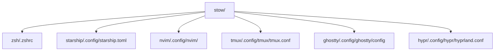

<!--
README Stow · dotfiles de RikiLaNeko
Dernière mise à jour : 2025-07-02
-->

<h1 align="center"> Dotfiles & <span style="color:#6a3d8b;">GNU Stow</span></h1>
<p align="center">
  <b>Symlinks propres, configs modulaires, installation instantanée</b>
</p>

<p align="center">
  <a href="https://www.gnu.org/software/stow/"></a>
  <a href="https://catppuccin.com/"></a>
</p>

---

## 📖 Sommaire

- [Pourquoi Stow ?](#pourquoi-stow)
- [Diagramme](#diagramme)
- [Règles de structure](#règles-de-structure)
- [Guide d’utilisation pas-à-pas](#guide-dutilisation-pas-à-pas)
- [Exemples concrets](#exemples-concrets)
- [Bonnes pratiques & astuces](#bonnes-pratiques--astuces)
- [FAQ](#faq)
- [Liens utiles](#liens-utiles)

---

## 🌈 Pourquoi Stow ?

- **Symlinks modulaires** : chaque app indépendante, déployable/supprimable proprement.
- **Portabilité** : 1 commande pour tout retrouver sur une nouvelle machine.
- **Git-friendly** : tout est versionné et lisible.

---

## 🗺️ Diagramme



---

## 🏗️ Règles de structure

- **Fichier attendu à la racine** :  
  → Ex : `.zshrc` → `stow/zsh/.zshrc`
- **Dans .config/** :  
  → Ex : `starship.toml` → `stow/starship/.config/starship.toml`
  → Ex : `nvim` → `stow/nvim/.config/nvim/`
- **Multi-fichiers** :  
  Organise dans `.config/` (ex : Ghostty, Hyprland, tmux...)

> **Astuce** : la structure du sous-dossier doit toujours refléter le chemin exact final dans `$HOME`.

---

## 🛠️ Guide d’utilisation pas-à-pas

### 1. Cloner le repo

```bash
git clone https://github.com/RikiLaNeko/dotfiles.git
cd dotfiles/stow
```

### 2. Déployer tout (recommandé)

```bash
stow .
```

> Cela symlinkera tous les dotfiles présents dans chaque sous-dossier vers ta `$HOME`, de façon propre.

### 3. Déployer une config spécifique

```bash
stow zsh         # crée ~/.zshrc
stow starship    # crée ~/.config/starship.toml
stow nvim        # crée ~/.config/nvim/
stow ghostty     # crée ~/.config/ghostty/config
```

### 4. Retirer une config

```bash
stow -D tmux     # supprime le symlink ~/.config/tmux
```

### 5. Ajouter une nouvelle app

```bash
mkdir -p stow/maapp/.config/maapp/
cp <monfichier> stow/maapp/.config/maapp/
stow maapp
```

---

## 📚 Exemples concrets

- **zsh**
  - `stow/zsh/.zshrc` → `~/.zshrc`
  - Plugins/snippets/aliases gérés dans le fichier, voir la section “snippets” du README principal.
- **starship**
  - `stow/starship/.config/starship.toml` → `~/.config/starship.toml`
- **ghostty**
  - `stow/ghostty/.config/ghostty/config` → `~/.config/ghostty/config`
- **hyprland**
  - `stow/hypr/.config/hypr/hyprland.conf` → `~/.config/hypr/hyprland.conf`

---

## 💎 Bonnes pratiques & astuces

- **Vérifie l’existant avant de stow** (sauvegarde d’anciens fichiers si besoin).
- **Unstow avant de supprimer un dossier** (sinon symlinks cassés).
- **Stow fonctionne aussi sous macOS**.
- **Commit régulier** = rollback facile.

---

## ❓ FAQ

**Q : Puis-je stow tout d’un coup ?**  
A : Oui, `stow .` va tout symlinker.

**Q : Que faire si un fichier existe déjà ?**  
A : Déplace-le/supprime-le ou utilise `stow -D` pour désinstaller proprement avant.

**Q : Et pour une gestion full déclarative ?**  
A : Regarde la branche NixOS de ce repo, ou découvre Home Manager.

---

## 🔗 Liens utiles

- [GNU Stow](https://www.gnu.org/software/stow/)
- [Catppuccin](https://catppuccin.com/)
- [Hyprland](https://hyprland.org/)

---

> **Un problème, une question ? Ouvre une issue !**
