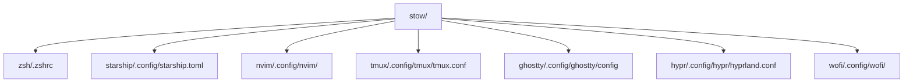

<h1 align="center" style="display:flex;justify-content:center;align-items:center;gap:10px;">
  
  Dotfiles &amp; <span style="color:#6a3d8b;">GNU Stow</span>
  <span style="margin-left:14px;font-size:1.1em;font-weight:bold;vertical-align:middle;">
    <span style="color:#f5c2e7;">d</span><span style="color:#cba6f7;">e</span>
    <span> </span>
    <span style="color:#f5c2e7;">R</span><span style="color:#cba6f7;">i</span><span style="color:#89b4fa;">k</span><span style="color:#94e2d5;">i</span><span style="color:#a6e3a1;">L</span><span style="color:#f9e2af;">a</span><span style="color:#fab387;">N</span><span style="color:#eba0ac;">e</span><span style="color:#74c7ec;">k</span><span style="color:#f38ba8;">o</span>
  </span>
</h1>
<p align="center">
  <b>Symlinks propres, configs modulaires, installation instantanée</b>
</p>

<p align="center">
  <a href="https://nixos.org/"></a>
  <a href="https://www.gnu.org/software/stow/"></a>
  <a href="https://github.com/ghostty-org/ghostty"></a>
  <a href="https://hyprland.org/"></a>
  <a href="https://neovim.io/"></a>
  <a href="https://github.com/zdharma-continuum/zinit">  </a>
  <a href="https://starship.rs/"></a>
  <a href="https://catppuccin.com/"></a>
</p>

---

> Merci à <b>tasiaiso</b> de m’avoir fait découvrir NixOS !  
> Et à la <a href="https://catppuccin.com/">communauté Catppuccin</a> pour le style et l’inspi !

---

## 🧐 Pourquoi ce setup ? Pourquoi Stow ?

- **Déploiement instantané** : un `git clone` + `stow` et tout est prêt, sur n’importe quel Linux.
- **Modularité** : chaque app a son dossier, j’active/désactive ce que je veux sans rien casser.
- **Hygiène** : zéro pollution, tout est symlinké proprement, mon `$HOME` reste clean.
- **Versionning** : tout sur GitHub, rollback/test ultra simple.
- **QOL/productivité** : prompts custom, alias utiles, config ultra-rapide pour bosser ou bidouiller.

---

## 🚀 Aperçu de mon environnement

- **Distro** : NixOS
- **WM/DE** : Hyprland
- **Terminal** : Ghostty
- **Shell** : Zsh + Zinit + plugins persos
- **Prompt** : Starship
- **Éditeur** : Neovim (LazyVim)
- **Launcher** : Wofi (Catppuccin)
- **Autres outils** : Zellij, Git, etc.

---

## 🏗️ Organisation du repo



---

## 📦 Installer mes dotfiles ?

```bash
git clone https://github.com/RikiLaNeko/dotfiles.git
cd dotfiles/
stow --adopt .
```
Pour une seule app :
```bash
stow zsh
```

---

## 🛠️ Exemples à explorer

- `.zshrc` — prompt
- `.zsh/` - configuration de ZSH complete et custom
- `.config/starship.toml` — prompt rapide & stylé
- `.config/nvim/` — config Neovim full Lua
- `.config/hypr/hyprland.conf` — WM dynamique & custom
- `.config/zellij/config.kdl` — splits/sessions QOL
- `.config/ghostty/config` — terminal moderne
- `.config/wofi/` — launcher Catppuccin

---

## ✨ Ce que ça m’a changé

- **Réinstall instantanée** : nouveau PC, VM, chroot ? Je suis prêt direct.
- **Test de configs sans douleur** : j’active/je vire ce que je veux.
- **Confort de travail** : tout est pensé pour être rapide, lisible, joli (merci Catppuccin !)
- **Pas de magie noire** : pas de dépendances bizarres, tout est documenté.

---

> Un souci, une question ? Ouvre une issue ou ping-moi sur GitHub !
